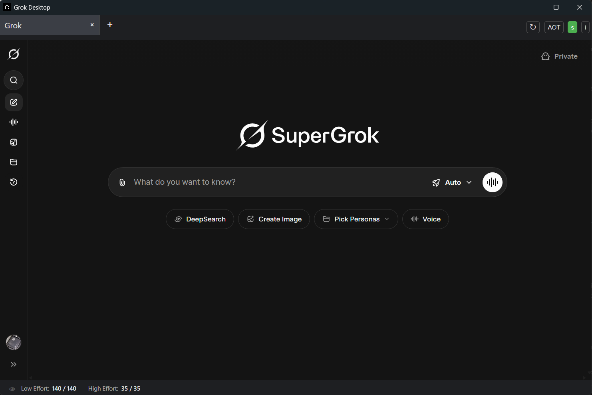

# Grok-Desktop v.1.1.0-pre

## Description
Grok-Desktop is a Nativefier based desktop application for Windows 10 and 11 that wraps `grok.com`, allowing desktop application-like access to Grok with support for xAI, Google, and Apple authentication.

## Features
- Desktop application wrapper for grok.com
- Tab functionality for multiple Grok conversations
- Support for xAI, Google, and Apple authentication
- No menu bar for a cleaner interface

## Download
[Download Grok-Desktop_Installer.exe](https://github.com/AnRkey/Grok-Desktop/releases/download/v1.1.0/Grok-Desktop_Installer.exe)

## Screenshot


## Prerequisites for use
- Windows 10 or 11
- Internet connection.
- Grok account required. You can sign up in app or use your Google or Apple account to login.

## Prerequisites for building
- Windows 10 or 11
- Internet connection.
- Node.js (LTS version, e.g., 20.x)

## Build Grok-Desktop
1. Install Node.js from [nodejs.org](https://nodejs.org/).
2. Open PowerShell and verify with `node -v` and `npm -v`.
3. Install Nativefier globally: `npm install -g nativefier`.
4. Clone this repository or download the files.
5. Edit `build_grok-desktop.bat` contents as needed or leave defaults as is.
6. Run the build script: `build_grok-desktop.bat` (or use the Nativefier command directly).
7. After building, you can run the test version with `run_test.bat`.

## Testing the Application
There are several scripts available for testing and running the application:

1. **install_deps.bat** - Installs all dependencies cleanly (removes existing node_modules first)
2. **test_app.bat** - Installs Electron if needed and runs the application for testing
3. **run_app.bat** - Runs the application using the installed Electron (faster if dependencies are already installed)
4. **run_test.bat** - Runs the built application from the test directory (requires running build_grok-desktop.bat first)

To test the application without building the installer:
```
.\build_grok-desktop.bat
.\run_test.bat
```

Or for development testing:
```
.\install_deps.bat
.\run_app.bat
```

## Usage
- Launch `Grok-Desktop.exe` from the `Grok-Desktop-windows-64` directory inside the build directory.
- Log in via `grok.com`, using Google, Apple, or xAI authentication as needed.
- Use the + button in the top toolbar to add new tabs.
- Click the Settings button in the bottom right to access application settings.

## Build Installer
1. Install Inno Setup from [Inno Setup Website](https://www.jrsoftware.org/isdl.php).
2. Open grok-desktop_installer.iss from Inno Setup Compiler and click "Compile" to build the installer.
3. The installer will be located in the `Grok-Desktop_Installer` sub-directory when the build is completed.

## Troubleshooting
- If you encounter issues with dependencies, run `install_deps.bat` to clean and reinstall all dependencies.
- If the application fails to start, check that Node.js is properly installed and in your PATH.
- If the tabs or settings button don't appear, try rebuilding with `build_grok-desktop.bat` and running with `run_test.bat`.
- For other issues, please open an issue on GitHub.

## License
This project is licensed under the GNU General Public License version 2.0 (GPL-2.0). See the (LICENSE) file for details.

## Contact
Contact an R key at anrkey@gmail.com

## Copyright Notice
I don't own the grok.ico file. I found it online and converted it to a .ico file.
If you are from X.ai or Grok.com and if my use of this artwork is a problem, please let me know and I'll remove it. If you are not using this application for private use then I would suggest using a different icon.

## Contributing
Details in CONTRIBUTING.md
