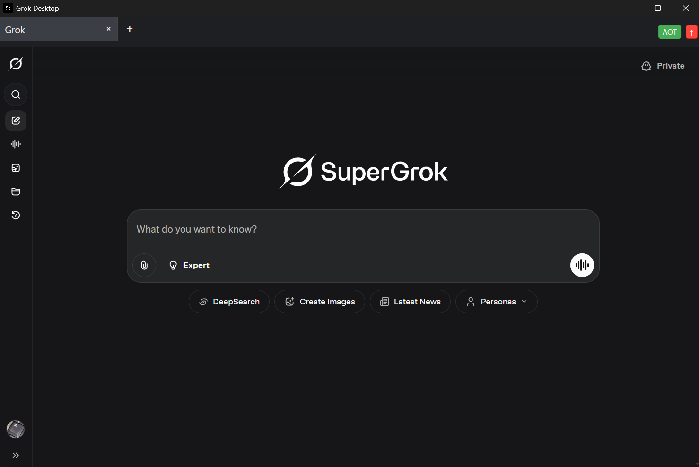

## Description
Grok-Desktop is an Electron-based desktop application for Windows 10 and 11 that wraps `grok.com`, allowing desktop-application-like access to Grok with support for xAI, Google, and Apple authentication.

## Screenshot

## Features
- Desktop application wrapper for grok.com
- Tabs functionality for multiple Grok conversations
- Support for xAI, Google, and Apple authentication
- No menu bar for a cleaner interface
- Always-on-top toggle (AOT button)
- System Dark/Light theme support; auto-adapts and forces light mode for Apple ID auth for reliability
- Grok speech mode supported (microphone/camera allowed; autoplay enabled)
- Update checks with in-app indicator/button
- Reload current tab button with icon and loading animation
- Keyboard shortcuts
  - Ctrl+T: New tab
  - Ctrl+Tab / Ctrl+Shift+Tab: Next/previous tab
  - Ctrl+R: Reload active tab
  - Ctrl+I: Show About dialog
- About dialog showing app name/version with links to GitHub and Discussions
- Context menu: Back/Forward/Reload, Inspect Element, spell-check suggestions, Add to Dictionary
- External links open in default browser; Grok/xAI/Google/Apple auth flows handled in‑app
- Single-instance app (subsequent launches focus the running window)

- Added
  - About dialog: new About button and `Ctrl+I` shortcut to open it
  - Reload button with icon and improved loading animation
  - Keyboard shortcuts for tab management and reload
  - MSI installer output and x64 installer support
- Changed
  - Upgraded Electron to v39.x (phased upgrades from 36 → 39)
  - Increased build compression to maximum for smaller artifacts
  - Enhanced build script with error handling and consistent artifact names
  - Center-aligned About section styling
  - Updated `tmp` dependency to latest
  - Added security report files to `.gitignore`
  - Removed brace-expansion overrides
- Fixed
  - Webview reload logic now manages loading state before reload
- Removed
  - Unused dependency: `electron-store`

## Changes since 1.2.3 (1.2.4 - 2025-12-14)

### Security
- **Domain Bypass Protection** - Prevents malicious subdomain attacks on trusted domains
- **Enhanced External URL Validation** - Validates protocols, hostnames, and blocks localhost/private IPs
- **Secure Update URL Validation** - Ensures GitHub release URLs are legitimate before storage

## Prerequisites for use
- Windows 10 or 11
- Internet connection
- Grok account required. You can sign up in app or use your Google or Apple account to login.

